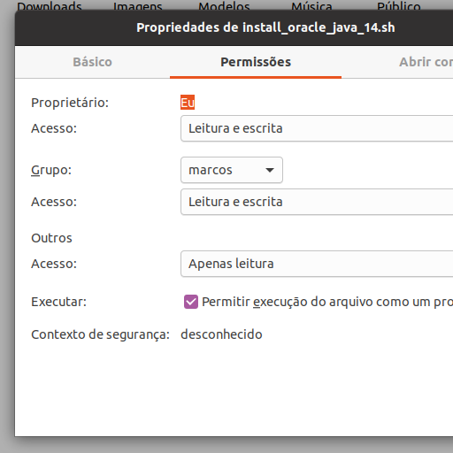

# This is a script to install Oracle's java 14 on Ubuntu
## Isto é um script para instalar o java 14 da Oracle no Ubuntu

# Download:
## Baixar
<a id="raw-url" href="https://raw.githubusercontent.com/markirius/ubuntu_java_install/master/ubuntu_java_install.sh">Download Java Installer</a>

# Steps:
## Passos:

1. Made nautilus ask for script execution / Faça o nautilus perguntar pela execução de scripts

  * Go to preferences / Vá para preferências
  

* On behavior check "ask each time" / Em comportamento marque "perguntar o que fazer"

* Now nautilus will ask for execution if file has marked as executable / Agora o nautilus irá perguntar pela execução se o arquivo for marcado como executável

2. Mark your downloaded file as executable / Maque seu arquivo baixado como executável:

* Right-click above "ubuntu_java_install.sh", go to properties / Clique com o botão direto sobre "ubuntu_java_install.sh", vá para propriedades

* Mark execute to allow the the file to execute as a program / Maque executar para permitir a execução do arquivo como um programa:

follow the steps (user password will be required for use in apt) of script and wait the complete install message / siga os passos (sua senha de usuário será requerida para uso no apt) do script e espere a mensagem de instalação concluída.

Maybe this script works on linuxmint the common edition, debian based will not work.
Talvez este script funcione no linuxmint a versão padrão, a baseada em debian não funcionará.

I hope this helps you!
Espero que isto te ajude!
