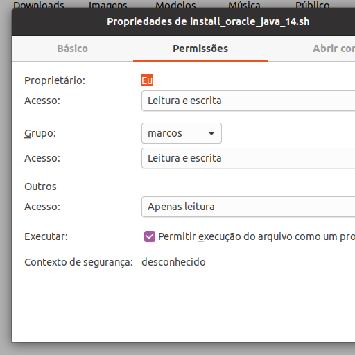

# Linguagens
<a id="raw-url" href="https://github.com/markirius/ubuntu_java_install/blob/master/README.md">English (en-us)</a>

# Isto é um script para instalar o java 14 da Oracle no Ubuntu

# Baixar:
<a id="raw-url" href="https://raw.githubusercontent.com/markirius/ubuntu_java_install/master/ubuntu_java_install.sh">Download Java Installer</a>

use o clique direito do mouse... "salvar link como..."

# Passos (baseado no Ubuntu 20.04):

1. Faça o nautilus perguntar pela execução de scripts

  * Vá para preferências

  * Em comportamento marque "perguntar o que fazer"

  * Agora o nautilus irá perguntar pela execução se o arquivo for marcado como executável

2. Maque seu arquivo baixado como executável:

  * Clique com o botão direto sobre "ubuntu_java_install.sh", vá para propriedades

  * Maque executar para permitir a execução do arquivo como um programa:

Depois disto tudo... dê um clique duplo (como um usuário Windows) no ubuntu_java_install.sh e a instalação vai começar

Siga os passos (sua senha de usuário será requerida para uso no apt) do script e espere a mensagem de instalação concluída... Talvez este script funcione no linuxmint a versão padrão, a baseada em debian não funcionará... Espero que isto te ajude!
